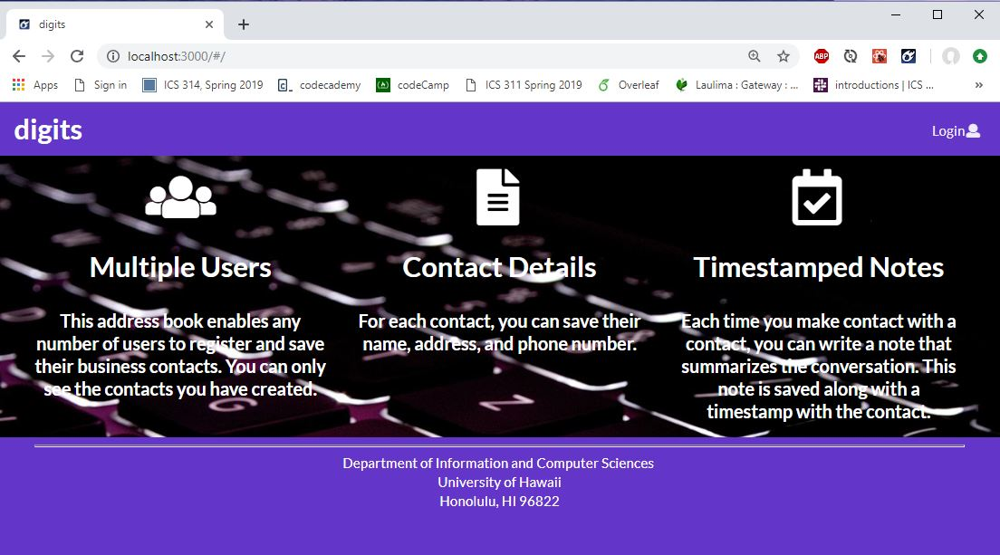

<h1>digits</h1>

This digits application enables users to:
<li>Create their own account</li>
<li>Create and edit an address book to save their contacts</li>
<li>Add notes that have timestamps</li>

<h3>Installation</h3>
<ol>
  <li>In order to begin using the application you will need to 
    <a href="https://www.meteor.com/install"> install Meteor </a>
  </li>
  <li>Next, you will need to 
    <a href="https://github.com/tylerchinen/digits">download a copy of digits</a>. 
  You should note that the digits repo is private and that you will need to request permission from the author in order to access the repo.
  </li>
  <li>Then, in the command prompt you will need to cd into the app directory (within the digits file) and install the Meteor library as follows: 
    

      <code> meteor npm install </code>
    

  </li>
  <li>After Meteor has been installed, you can then run the application by using:
    

      <code>meteor npm run start</code>
    

  </li>
  <li>After the app runs for the first time, it will create some default data and users. The output should look as follows:
    

      
    

    

      *It is important to note that there is a <b>bcrypt warning</b> which will try to encourage you to use bcrypt. However it is more difficult to install bcrypt with Windows operating systems. Bcrypt is unneccesary for the purposes that we are using for so it is okay to just ignore this warning, it will not interfere with the use of the application.
    

  </li>
  <li>If there are no errors, the template application will appear at <a href="http://localhost:3000/">http://localhost:3000/</a>. You can then login by using one of the default accounts at <a href="https://github.com/ics-software-engineering/meteor-application-template-react/blob/master/config/settings.development.json">settings.development.json</a> </li>
  <li>You can also use ESLint in the imports directory to check for general errors by using:
    

      <code>
        meteor npm run lint
      </code>
    

  </li>

<h4>User Interface Walkthrough</h4>

<h4>The Landing Page</h4>
  
When you first go to the application site, you will appear at the landing page that gives you a brief overview of the application.

  

<h4>The Registration Page</h4>
  
To get to this page you would click on the "Login" button, and then the "sign up" option on the dropdown menu. Here you are able to create a new account. 

  

<h4>The Login Page</h4>
  
You can reach this page by clicking on the "Login" button, and then on "Sign in" option on the dropdown menu. This page lets you log in to your account.

  

<h4>The Home Page</h4>
  
Once you have logged in you will be rerouted to the homepage. This looks the same as the landing page however, it shows you more options in the Navigation bar: Add Contact, and List Contacts, as well as your email in the upper right hand corner, which indicates the account that you are logged into.

  

<h4>The List Contacts Page</h4>
  
This page can be accessed by clicking on the List Contacts tab in the Nav bar. This brings up the page that lists all of the contacts that were added by the user that is logged in.

  
  
  
This page also shows the timestamped notes which can be used to add comments or notes about the conversations that the user had with their contact. An example is shown below.

    
    
  
<h4>The Add Contacts Page</h4>
  
This page can be accessed by clicking on the tab in the Nav bar. On this page you are able to add a contact into your list of contacts by filling out all of the fields that are presented.

  

<h4>The Edit Contacts Page</h4>
  
This page can be accessed by clicking on the Edit label below a contacts information on the "List Contacts" page. You will then be rerouted to a page that looks very similar to the "Add Contact" page however it already shows the information filled out with the information for the given user that you would like to edit. From there you can make changes to the contact's information.

  

<h4>Admin Mode</h4>
  
This mode can be accessed by users who are granted access in the settings folder of the file. This can be edited to add more Admin users. The Admin mode grants access to the "Admin" tab on the Nav bar which shows a page of all of the contacts in the application along with the user accounts who added them.

  
